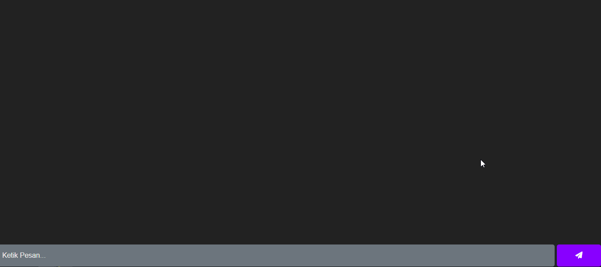

# Responsive Chat App (Beta Version)

## Overview
This is a simple responsive chat application built using HTML, CSS, Bootstrap, and Firebase Realtime Database. It allows users to send and receive messages in real-time.

## Features
- **Real-time Messaging**: Send and receive messages instantly.
- **Responsive Design**: Works seamlessly on various devices and screen sizes.
- **Message Deletion**: Users can delete their sent messages.
- **Dynamic UI**: Messages are displayed dynamically without page reload.

## Technologies Used
- HTML 
- CSS 
- Bootstrap 
- Firebase Realtime Database 

## How to Use
1. Clone the repository.
2. Open `index.html` in your web browser.
3. Enter your name when prompted.
4. Start sending and receiving messages!

## Screenshots

## Demo
[Live Demo](https://your-live-demo-link)

## Contributions
Contributions are welcome! Feel free to submit issues and pull requests.

## License
This project is licensed under the [MIT License](/LICENSE).

## Support
For any inquiries or support, please contact [the developer](mailto:developer@example.com).

## Acknowledgements
- Font Awesome for icons
- Firebase for real-time database
- Bootstrap for responsive design

